# Credit_Risk_Analysis
In this project, we will predict credit card loan risk with machine learning models that we will build and evaluate using Python software and imbalanced-learn and Scikit libraries.

## Project Background
All over the world, people borrow money to purchase homes or cars, start businesses, and pursue education.   
Loans are an essential part of modern society, but loans present an opportunity and challenge for banks and other lending institutions.  
On the one hand, loans create revenue with the interest they generate; on the other hand, there is a risk that borrowers will not repay loans, and banks will lose money.  
Banks have traditionally relied on measures like income, credit scores, and collateral assets to assess lending risk. Nevertheless, the rise of financial technology or FinTech has enabled lenders to use machine learning to analyze risk.  

Fast Lending, a peer-to-peer lending services company, wants to use machine learning to predict credit risk.  
Management believes that this will provide a quicker and more reliable loan experience. It also believes that machine learning will lead to more accurate identification of suitable loan candidates, leading to lower default rates.   

Machine learning can process a large amount of data to arrive at a single decision; whether or not to approve that loan application.  

Credit risk, however, is an inherently unbalanced classification problem, as good loans easily outnumber risky loans.  

Therefore, we will need to employ different techniques to train and evaluate models with unbalanced classes.  

In this project, we will use Python and the Scikit library to build and evaluate several machine learning models to predict credit risk.  

### Project Purpose

Using the credit card dataset from LendingClub, a peer-to-peer lending services company, we will oversample the data via the RandomOverSampler and SMOTE algorithms. Then we will undersample the same dataset using the ClusterCentroids algorithm.  Furthermore, we will use a combinatorial approach of over- and undersampling using the SMOTEENN algorithm.  
Next, we will compare two new machine learning models that reduce bias, BalancedRandomForestClassifier, and EasyEnsembleClassifier, to predict credit risk.  
Finally, we will evaluate the performance of these models and give recommendations to the Fast Lending company on whether they should be used to predict credit risk.

## Objectives
1. Use Resampling Models to Predict Credit Risk
2. Use the SMOTEENN Algorithm to Predict Credit Risk
3. Use Ensemble Classifiers to Predict Credit Risk

## Resources
- Data Sources: LoanStats_2019Q1.csv, credit_risk_resampling.ipynb, credit_risk_ensemble.ipynb.
- Software & Frameworks: Python (3.7).
- Libraries & Packages: Jupyter Notebook, NumPy (1.21.5), Scipy (1.7.3), Scikit-learn (1.0.2) for Over- and Under-sampling algorithms, Scikit-learn (0.23.2) for Ensemble Learning, imbalanced-learn library (0.7.0).
- Online Tools: [Credit_Risk_Analysis GitHub repository.](https://github.com/SamaanAnalyst/Credit_Risk_Analysis)

## Methods & Code

1. We will use the imbalanced-learn and scikit-learn libraries and evaluate three resampling machine learning models to determine which is better at predicting credit card risk. 
    - First, we will use the oversampling RandomOverSampler and SMOTE algorithms.
        - We started with the credit card loans dataset that contained 144 columns, and we filtered it down to 86 columns of interest:   
        
        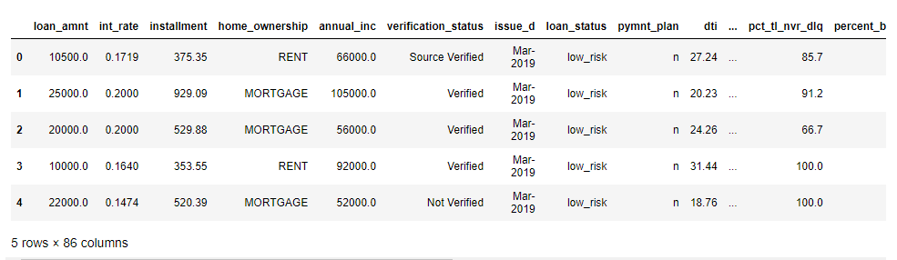  
        
        - We transformed the focused dataset by dropping NaNs, converting interest rate to float type, and filtered for not-yet issued loans. 
        - Additionally, we encoded the loan status -the target variable, to low-risk and high-risk applications and then converted them to numerical values so that low risk: 1 and high risk: 0.
        - Finally, we transformed the string values of 9 columns into numerical ones using the get_dummies() method, which increased the total number of columns to 95.  
    
        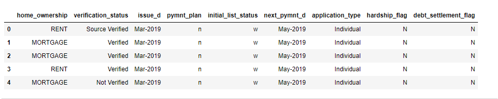 
    
        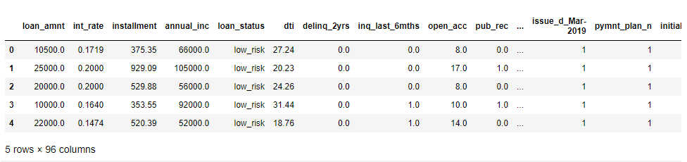 
    
        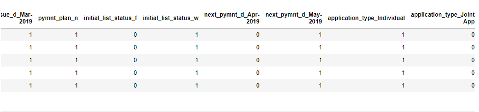 
    
        - Next, we preprocessed the final dataset and defined the target variable as the loan status, while all other variables (95) are features.  
    
        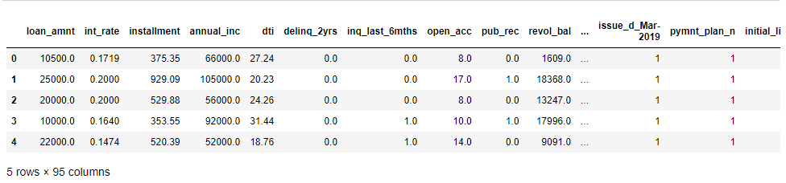 
    
        - We resampled the training data with the Naive Random Oversampling model, then instantiated and trained a logistic regression model on the resampled data to make predictions on the test data.  
        - Then, we resampled the data using the Synthetic Minority Oversampling Technique or SMOTE to balance the loans dataset and train the logistic regression model on the resampled data.
    - Next, We test the Cluster Centroids undersampling model to determine which algorithm performs better.
2. We tested a combination over- and under-sampling algorithm to determine if the algorithm performs better than the other sampling algorithms. 
    - We resampled the preprocessed credit card dataset using the SMOTEENN algorithm that combines the SMOTE and Edited Nearest Neighbors (ENN) algorithms. 
    - Then made predictions with a logistic regression model.
    
3. Using the imblearn.ensemble library, we trained and compared two different ensemble classifiers, Balanced Random Forest Classifier and Easy Ensemble AdaBoost Classifier, to predict credit card risk and evaluate each model.
    - Using both algorithms, we resampled the dataset, counted the target classes, trained the ensemble classifier, and calculated the performance metrics. 
    

## Results

1. Oversampling and Undersampling the credit card loans dataset for the first quarter of 2019 by the lending services company:  
    - The loans dataset contained 115,675 rows of data in 144 columns.  
    - Each row in the dataset represented an application for a credit card loan and information about the applicant, including:  
    loan amount, interest rate, home ownership, annual income, demographics, payments, hardship, and settlement info, among many other details. 
    
    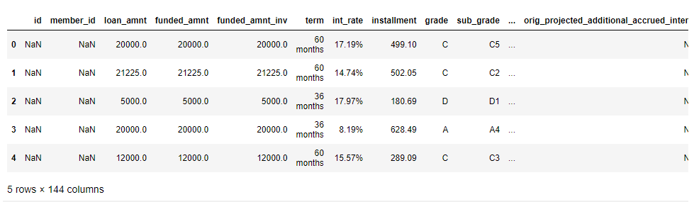 
    
    - The summary statistics on the loan features were as follows:  
    
     
    
    - Out of 68,817 records in the loans dataset,68,470 applications were low risk, and only 347 were high risk.  
    - The **Random Oversampling** model redistributed the data as follows: {'low_risk': 51366, 'high_risk': 51366}  
        - The logistic regression model using the resample data gave such predictions:  
    
        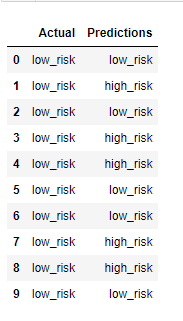 
    
        - The accuracy of the logistic regression model used to predict the risk of credit card loan applications based on the Random Oversampling technique was 68%.  
        - The classification report would show us that while precision was very high (100%) for the majority class of low-risk applications, precision in predicting high-risk applications was deficient (1%), which indicated a high number of false positives meaning an unreliable positive classification.  
        - However, the recall (sensitivity) was 64% and 71% for low-risk and high-risk applications, respectively.  
        - It seems that the logistic regression model using the Random Oversampling technique better screened for high-risk loan applications. 
        - The classification report for Random Oversampling was as follows: 
    
        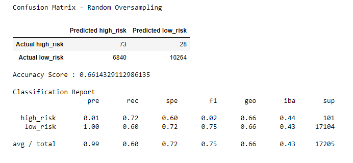 
    
    - The **Synthetic Minority Oversampling Technique** or **SMOTE** balanced the loans dataset in the same way as the previous model {'low_risk': 51366, 'high_risk': 51366}. 
        - The confusion matrix results of the logistic regression model in this instance were very close to the Random Oversampling technique.  
        - The accuracy of the logistic regression model used to predict the risk of credit card loan applications based on the Random Oversampling technique was 66%.
        - The classification report for SMOTE was as follows: 
    
        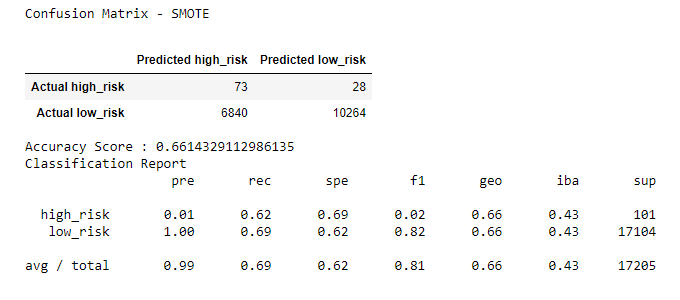 
    
    - The **Cluster Centroids** resampler balanced the same credit card loans dataset and split the target classes as follows: {'high_risk': 246, 'low_risk': 246}.
        - The accuracy score of the logistic regression model used to predict the risk of credit card loan applications based on the Cluster Centroids Undersampling technique was only 55%.
        - While precision in predicting the majority group of low-risk applications was still at 100%, other metrics like the recall rate were compromised by undersampling. 
        - The sensitivity for detecting high-risk applications was close to the previous Random oversampling model with 69%, but the F1 score remained very low.
        - The classification report for Cluster Centroids Undersampling was as follows:  
        
        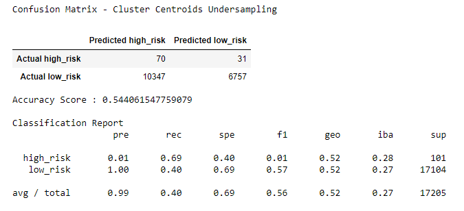  
    
2. The Combination (Over and Under) Sampling, SMOTEENN, balanced the credit card dataset as follows: {'high_risk': 68458, 'low_risk': 62022}.
    - The accuracy score of the logistic regression model used to predict the risk of credit card loan applications based on the SMOTEENN resampling technique was the highest among all previous models, with 67%. 
    - While precision for predicting low-risk loans is 100%, the sensitivity was 57%. 
    - The most impressive about this resampling algorithm was the sensitivity rate in detecting high-risk loan applications with 77%, which indicates the lowest false-negative predictions, even though precision was only 1%.     
    - The classification report for the SMOTEENN model was as follows:  
        
    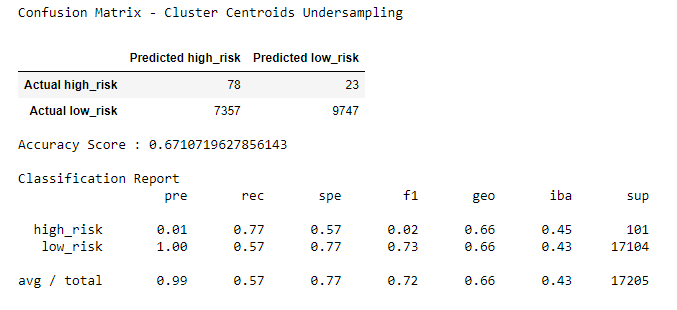 
    
3. We used Ensemble algorithms to assess credit card loan risk and compared them to the abovementioned oversampling and undersampling techniques. 
    - First, we trained the Balanced Random Forest classifier on the same credit card loans preprocessed dataset and made predictions. 
        - The accuracy score of this classifier's predictions was 79%. 
        - This ensemble algorithm showed high sensitivity in detecting both low and high-risk loan applications with 87% and 70%, respectively. 
        - However, the precision of predictions was incomparable between the two classes, with 100% for low-risk and only 3% for high-risk applications. 
        - The top feature that influenced the prediction of risk in credit card loan applications was the total recommended principle of the applicant, as shown in the following image of the top 10 features per importance:  
    
        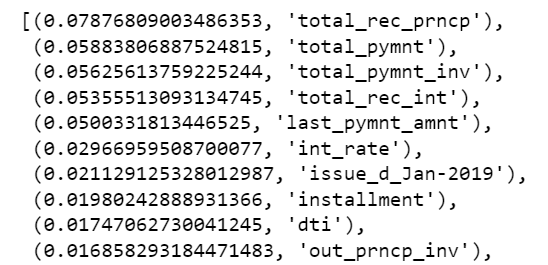 
    
        - The classification report for the Balanced Random Forest classifier was as follows:  
    
        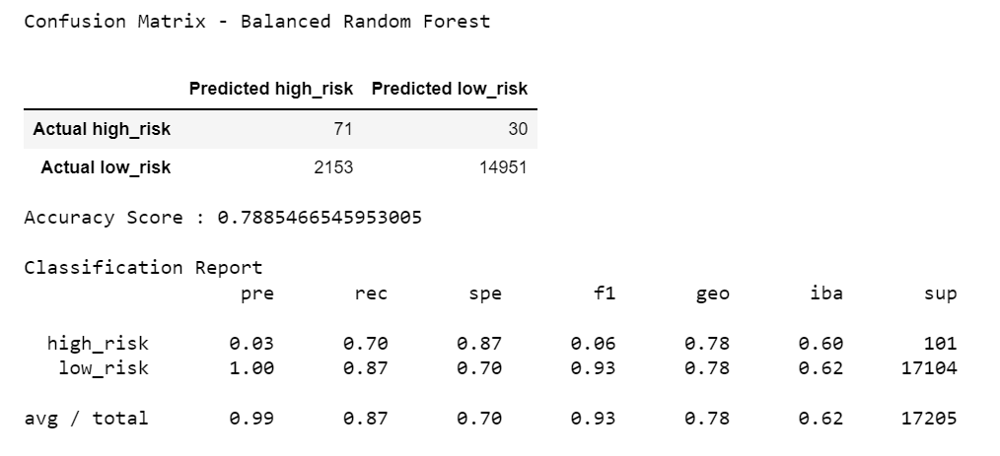 
 
    - Second, we used the Easy Ensemble AdaBoost classifier to determine the risk on the same dataset:
        - The accuracy score of this algorithm was the highest among all applied techniques in this analysis, at 93%. 
        - The sensitivity in predicting both classes of risk was comparable with 92% for high-risk and 94% for low-risk, which indicated the lowest number of false negatives (false high-risk predictions) and impressive specificity for both classes. 
        - The precision of high-risk predictions was superior to all other machine learning models, with 9% and 100% for low-risk applications. 
        - The classification report for the Easy Ensemble AdaBoost classifier was as follows: 
    
        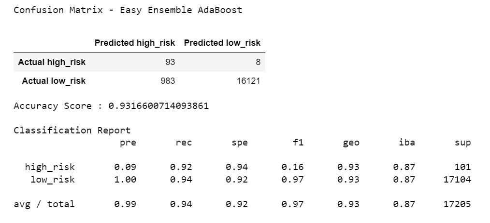  
    
    - It is worth noting how highly efficient the ensemble learning algorithms were in achieving the task with a reduced number of coding steps and processing time.  

## Recommendations

1. Among the following Machine Learning models for resampling data: Naive Random Oversampling, Synthetic Minority Oversampling Technique (SMOTE), Cluster Centroids Undersampling, and SMOTEENN (combines SMOTE and Edited Nearest Neighbors (ENN) algorithms) for combination resampling, the latest has shown the highest screening power for high-risk credit card loan applications.
    
2. Among the Ensemble Learning algorithms, the Easy Ensemble AdaBoost classifier was the best in performance scores, especially in detecting high-risk credit card applications considering their low rate.
    
3. The Ensemble Learning algorithms: Balanced Random Forest and Easy Ensemble AdaBoost were superior in efficiency and performance scores to the resampling algorithms used for this analysis.
    
4. Although both Ensemble Classifiers performed high, we recommend using the Easy Ensemble AdaBoost Classifier to predict high-risk credit card loan applications due to its high sensitivity in this analysis. Hence the Easy Ensemble AdaBoost model would be considered a better screening algorithm for a minority class. 
    
    
---
